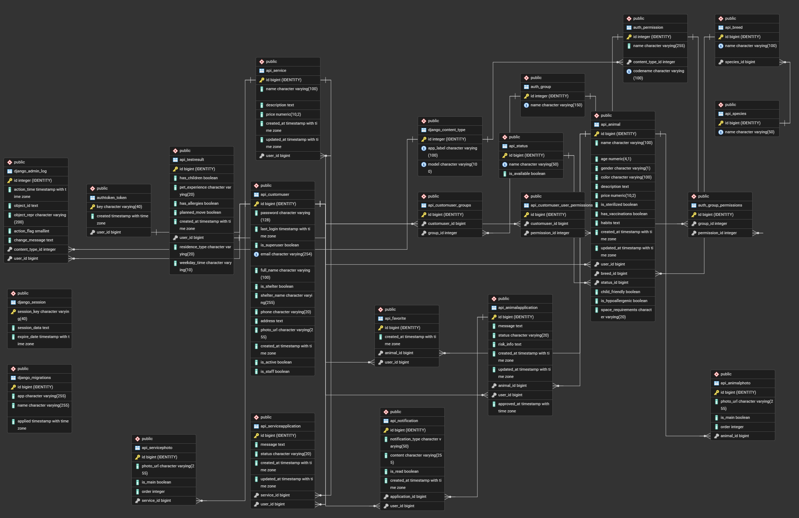

# PetLink – подбор животных

[]()
[]()
[]()
[]()

PetLink - мобильное приложение и backend‑сервис для подбора животных из приютов и частных объявлений.
Приложение поддерживает роли покупателя и приюта, гостевой режим, тест совместимости, систему заявок и уведомлений.

---

## Ключевые возможности

- **Каталог животных**
  - Лента объявлений с фотографиями и статусами.
  - Расширенная фильтрация: вид, порода, пол, возрастные диапазоны, цена, стерилизация, прививки, гипоаллергенность, дружелюбие к детям, требования к пространству.
  - Детальная карточка животного с тегами и фотогалереей.

- **Профиль пользователя и гостевой режим**
  - Регистрация и вход по email и паролю (токен‑авторизация).
  - Восстановление пароля по email.
  - Гостевой режим с ограниченным функционалом.

- **Избранное и мои объявления**
  - Добавление/удаление объявлений в избранное.
  - Экран избранного с быстрым переходом к карточке животного.
  - Экран «Мои объявления»: активные и архивные объявления с отдельными списками.
  - Создание/редактирование объявления с загрузкой нескольких фото, выбором главного фото и управлением галереей.

- **Заявки и оценка рисков**
  - Подача заявок на животных от лица покупателя.
  - Две перспективы: «Мои заявки» (покупатель) и «Входящие заявки» (продавец).
  - Автоматическая генерация текстового описания рисков на основе теста пользователя.
  - Управление заявками продавцом с изменением статуса и автоматическим переводом животного в архив.

- **Тест совместимости и рекомендации**
  - Обязательный тест при первом входе после регистрации.
  - Хранение результатов в модели TestResult.
  - Генерация рекомендаций по шаблонам (учёт жилья, времени дома, детей, аллергий, опыта владения).
  - Подбор животных по рекомендованным породам/фильтрам и показ рекомендаций в главном экране.

- **Уведомления и фоновые задачи**
  - Периодическая фонова́я задача на Android (WorkManager), проверяющая новые уведомления.
  - Отображение системных уведомлений с переходом к списку входящих заявок.
  - Экран настроек уведомлений с возможностью включать/отключать оповещения.
  - Отображение уведомлений в нижней навигации (подсветка иконки при наличии новых заявок).

- **Отчёты для приютов**
  - Отчёты по проданным и купленным животным в формате CSV.
  - Выбор периода: год или конкретный месяц.
  - Генерация на стороне backend и сохранение файла в папку «Загрузки» на устройстве.

---

## Архитектура

Репозиторий - монорепо из двух основных частей:

- [backend/](cci:7://file:///c:/Code/petlink-project/backend:0:0-0:0) - Django REST API.
- [frontend/app/](cci:7://file:///c:/Code/petlink-project/frontend/app:0:0-0:0) - Android‑приложение на Kotlin.

### Backend (Django + DRF)

Структура:

- [api/models.py](cci:7://file:///c:/Code/petlink-project/backend/api/models.py:0:0-0:0)
  - CustomUser (email‑логин, флаг `is_shelter`, контактные данные, аватар).
  - Справочники: Species, Breed, Status.
  - Каталог: Animal, AnimalPhoto, Favorite.
  - Тест: TestResult с методом get_recommendations().
  - Заявки: AnimalApplication, ServiceApplication + метод generate_risks().
  - Уведомления: Notification + сигнал `post_save` на создание уведомления при новой заявке.

- [api/serializers.py](cci:7://file:///c:/Code/petlink-project/backend/api/serializers.py:0:0-0:0)
  - UserSerializer, RegisterSerializer.
  - AnimalSerializer (поле `is_favorite`, валидация возраста, выбор дефолтного статуса).
  - Сериализаторы справочников и фотографий.
  - TestResultSerializer.
  - AnimalApplicationSerializer(блокировка дубликатных заявок).

- `api/views.py`
  - ViewSet’ы для всех основных сущностей.
  - `AnimalViewSet`:
    - продвинутая фильтрация по query‑параметрам,
    - методы `favorite`, `favorites`,
    - защита операций изменения/удаления чужих объявлений.
  - `TestResultViewSet`:
    - выдача рекомендаций и списка рекомендованных животных.
  - `AnimalApplicationViewSet`:
    - фильтрация по роли и статусу,
    - логика смены статуса с переводом животного в архив и отклонением остальных заявок.
  - `ShelterStatsViewSet` - генерация CSV‑отчётов по продажам/покупкам.
  - `NotificationViewSet` - чтение и массовая отметка о прочтении.
  - API для регистрации, получения текущего пользователя, загрузки файлов и запроса письма для сброса пароля.

- [petlink_api/urls.py](cci:7://file:///c:/Code/petlink-project/backend/petlink_api/urls.py:0:0-0:0)
  - [api/](cci:7://file:///c:/Code/petlink-project/backend/api:0:0-0:0) - маршруты основного API (viewset’ы через `api/urls.py`).
  - `api-token-auth/` - получение токена.
  - `api/auth/register/`, `api/auth/user/`.
  - `api/auth/password-reset/*` - стандартные Django‑вью для подтверждения и завершения сброса пароля.

- [api/tests/](cci:7://file:///c:/Code/petlink-project/backend/api/tests:0:0-0:0)
  - [test_models.py](cci:7://file:///c:/Code/petlink-project/backend/api/tests/test_models.py:0:0-0:0) - юнит‑тесты модели пользователя, сущностей вида/породы/животного.
  - [test_views.py](cci:7://file:///c:/Code/petlink-project/backend/api/tests/test_views.py:0:0-0:0) - интеграционные тесты API регистрации, логина, фильтрации животных.

### Android (Kotlin)

Пакеты:

- [ui/](cci:7://file:///c:/Code/petlink-project/frontend/app/src/main/java/com/example/petlink/ui:0:0-0:0)
  - `HomeContent` - главный экран с лентой животных и фильтрами .
  - `ui/home/AnimalDetailActivity` - карточка животного, теги, избранное, подача заявки.
  - `ui/ads/MyAdsActivity` + `MyAdsFragment` - «Мои объявления» (активные/архив).
  - `ui/myanimal/EditAnimalActivity`, `MyAnimalDetailActivity` - создание/редактирование/удаление объявления, управление фотогалереей.
  - `ui/favorites/FavoritesActivity` - избранное.
  - `ui/applications/ApplicationsActivity` - заявки и их детализация.
  - `ui/auth/LoginActivity`, `RegActivity` - аутентификация и регистрация (с восстановлением пароля).
  - `ui/test/TestActivity` - прохождение теста совместимости.
  - `ui/profile/ProfileActivity`, `NotificationSettingsActivity` - профиль пользователя, отчёты, настройки уведомлений.

- `data/model/`
  - Data классы для животных, фотографий, статусов, пользователей, тестов, заявок, уведомлений.

- `api/PetLinkApi.kt`
  - Retrofit‑интерфейс для всех REST‑эндпоинтов backend.

- [util/](cci:7://file:///c:/Code/petlink-project/frontend/app/src/main/java/com/example/petlink/util:0:0-0:0)
  - `RetrofitClient` - настройка Retrofit.
  - `UserSession` - работа с сессией пользователя и гостевым режимом (SharedPreferences).
  - `BottomNavHelper` - нижняя навигация и подсветка иконки уведомлений.
  - `NotificationsWorker`, `NotificationsScheduler`, `NotificationHelper`, `NotificationPreferences` - фоновые задачи и отображение уведомлений.


---

## Схема базы данных

Cхема связей основных моделей (ER‑диаграмма):



---

## Развёртывание и запуск

### Backend (локально)

Требования:

- Python 3.10+
- pip / virtualenv
- SQLite (по умолчанию) или другая поддерживаемая Django БД

Шаги:

```bash
# из корня репозитория
cd backend

# создать и активировать виртуальное окружение
python -m venv venv
venv\Scripts\activate  # Windows

# установить зависимости
pip install -r requirements.txt

# применить миграции
python manage.py migrate

# создать суперпользователя (опционально)
python manage.py createsuperuser

# запустить сервер разработки
python manage.py runserver 0.0.0.0:8000
```

После этого API будет доступен по адресу `http://127.0.0.1:8000/api` или же `/admin`.

### Android‑приложение (локально)

Требования:

- Android Studio (Arctic Fox или новее)
- Android SDK 24+

Шаги:

1. Открыть папку [frontend/app](cci:7://file:///c:/Code/petlink-project/frontend/app:0:0-0:0) в Android Studio как проект.
2. Убедиться, что `RetrofitClient.BASE_URL` указывает на адрес backend (по умолчанию `http://10.0.2.2:8000/` для эмулятора).
3. Собрать и запустить конфигурацию на эмуляторе или реальном устройстве.

---

## Используемые технологии

**Backend**

- Python / Django
- Django REST Framework
- Django auth + rest_framework.authtoken
- SQLite / другая SQL‑БД

**Android**

- Kotlin
- Android SDK, AppCompat, RecyclerView, ViewPager
- Retrofit2 + GsonConverter
- OkHttp + HttpLoggingInterceptor
- WorkManager
- NotificationCompat
- Glide для загрузки изображений

---

## Примеры запросов к API

Ниже - несколько запросов к backend API (предполагается запущенный сервер на `http://127.0.0.1:8000`).

### Регистрация пользователя

```bash
curl -X POST http://localhost:8000/api/auth/register/ \
  -H "Content-Type: application/json" \
  -d '{
        "email": "user@example.com",
        "full_name": "Test User",
        "password": "StrongPass123",
        "is_shelter": false
      }'
```

Пример успешного ответа (200):

```json
{
  "user": {
    "id": 1,
    "email": "user@example.com",
    "full_name": "Test User",
    "is_shelter": false,
    "shelter_name": "",
    "phone": "",
    "address": "",
    "photo_url": null
  },
  "message": "User created succesfully. Now perform login to get your token"
}
```

### Получение токена

```bash
curl -X POST http://localhost:8000/api-token-auth/ \
  -H "Content-Type: application/json" \
  -d '{
        "username": "user@example.com",
        "password": "StrongPass123"
      }'
```

Ответ:

```json
{
  "token": "0123456789abcdef..."
}
```


### Добавление объявления (животного)

```bash
curl -X POST http://localhost:8000/api/animals/ \
  -H "Authorization: Token <TOKEN>" \
  -H "Content-Type: application/json" \
  -d '{
        "name": "Мурка",
        "breed": 3,
        "age": 2,
        "gender": "F",
        "color": "Серый",
        "description": "Дружелюбная кошка",
        "price": 0,
        "is_sterilized": true,
        "has_vaccinations": true,
        "is_hypoallergenic": false,
        "child_friendly": true,
        "space_requirements": "low"
      }'
```

### Подача заявки на животное

```bash
curl -X POST http://localhost:8000/api/animal_apps/ \
  -H "Authorization: Token <TOKEN>" \
  -H "Content-Type: application/json" \
  -d '{
        "animal": 42,
        "message": "Хотим забрать кошку в любящую семью"
      }'
```

При наличии активной заявки от этого пользователя на это животное сервер вернёт ошибку с сообщением о дубликате.

---
